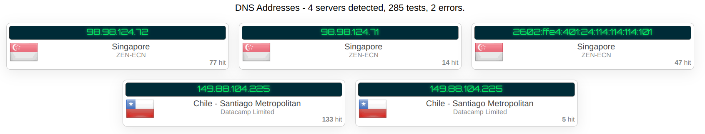
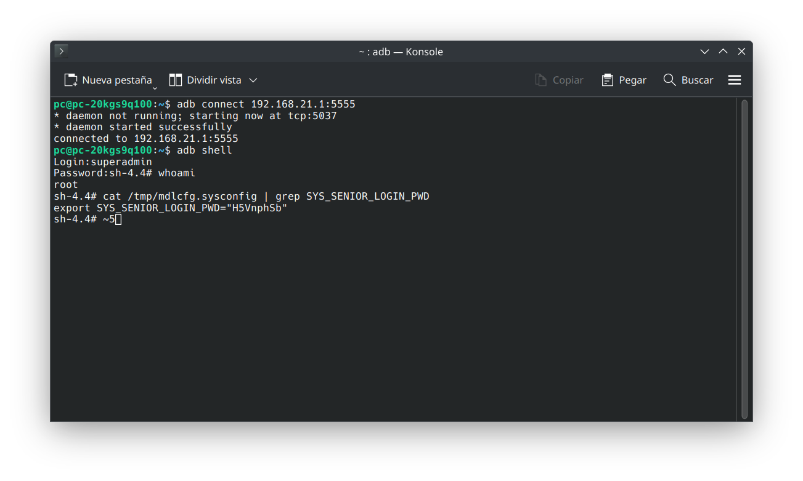

> [!CAUTION]
> 
> SI usas este modem, estas enviando tus datos a china, se conecta a sus dns, estoy buscando una solucion
> 
> sh-4.4# cat /tmp/mdlcfg.sysconfig | grep DNS

> [!NOTE]
> Change this
> USR_WAN_LINK_DETECT_DNSV4_SERVER2="119.29.29.29" 
> USR_WAN_LINK_DETECT_DNSV4_SERVER3="180.76.76.76" 
 
 
> mdlcfg -f USR_WAN_LINK_DETECT_DNSV4_SERVER2="8.8.8.8" 
> mdlcfg -a USR_WAN_LINK_DETECT_DNSV4_SERVER2="8.8.8.8" 
> mdlcfg -f USR_WAN_LINK_DETECT_DNSV4_SERVER3="8.8.4.4" 
> mdlcfg -a USR_WAN_LINK_DETECT_DNSV4_SERVER3="8.8.4.4" 
> mdlcfg -c

# China-Unicom-vn009
todo lo que encontre sobre el modem china unicom vn009 (no lo voy a poner en ingles, existen traductores online etc)

1 - tenia el firmware 2.5.2 y lo actualice a 2.6.0 link: https://drive.google.com/file/d/1mFwEZvrswGBBJW-IEsehn1zKaN_3wiVz/view?usp=sharing

UPDATE: 2.7 LINK: https://drive.google.com/file/d/1M-jGhMjvqeNINps3nLc_I5-wt0TBN8Zw/view?usp=sharing (NO FUNCIONA ADB)

superuser password (adb)  https://developer.android.com/tools/releases/platform-tools

https://tool.zootu.cn/tools/api/007imei/
> [!NOTE]
> adb connect 192.168.21.1:5555 
> adb shell  
> Login:superadmin 

> [!IMPORTANT]
Password:lo que te dio la pagina de arriba (https://tool.zootu.cn/tools/api/007imei/)

login web como super usuario:
en la shell poner este comando

cat /tmp/mdlcfg.sysconfig | grep SYS_SENIOR_LOGIN_PWD

usuario: root
contraseña: la que da el comando de arriba

adios, no  he cambiado imei ni nada, solo queria buscar el login root del modem y compartir como lo hice 👽

                                                                          ⣿⣿⣿⣿⣿⠟⠋⠄⠄⠄⠄⠄⠄⠄⢁⠈⢻⢿⣿⣿⣿⣿⣿⣿⣿
                                                                          ⣿⣿⣿⣿⣿⠃⠄⠄⠄⠄⠄⠄⠄⠄⠄⠄⠄⠈⡀⠭⢿⣿⣿⣿⣿
                                                                          ⣿⣿⣿⣿⡟⠄⢀⣾⣿⣿⣿⣷⣶⣿⣷⣶⣶⡆⠄⠄⠄⣿⣿⣿⣿
                                                                          ⣿⣿⣿⣿⡇⢀⣼⣿⣿⣿⣿⣿⣿⣿⣿⣿⣿⣧⠄⠄⢸⣿⣿⣿⣿
                                                                          ⣿⣿⣿⣿⣇⣼⣿⣿⠿⠶⠙⣿⡟⠡⣴⣿⣽⣿⣧⠄⢸⣿⣿⣿⣿
                                                                          ⣿⣿⣿⣿⣿⣾⣿⣿⣟⣭⣾⣿⣷⣶⣶⣴⣶⣿⣿⢄⣿⣿⣿⣿⣿
                                                                          ⣿⣿⣿⣿⣿⣿⣿⣿⡟⣩⣿⣿⣿⡏⢻⣿⣿⣿⣿⣿⣿⣿⣿⣿⣿
                                                                          ⣿⣿⣿⣿⣿⣿⣹⡋⠘⠷⣦⣀⣠⡶⠁⠈⠁⠄⣿⣿⣿⣿⣿⣿⣿
                                                                          ⣿⣿⣿⣿⣿⣿⣍⠃⣴⣶⡔⠒⠄⣠⢀⠄⠄⠄⡨⣿⣿⣿⣿⣿⣿
                                                                          ⣿⣿⣿⣿⣿⣿⣿⣦⡘⠿⣷⣿⠿⠟⠃⠄⠄⣠⡇⠈⠻⣿⣿⣿⣿
                                                                          ⣿⣿⣿⣿⡿⠟⠋⢁⣷⣠⠄⠄⠄⠄⣀⣠⣾⡟⠄⠄⠄⠄⠉⠙⠻
                                                                          ⡿⠟⠋⠁⠄⠄⠄⢸⣿⣿⡯⢓⣴⣾⣿⣿⡟⠄⠄⠄⠄⠄⠄⠄⠄
                                                                          ⠄⠄⠄⠄⠄⠄⠄⣿⡟⣷⠄⠹⣿⣿⣿⡿⠁⠄⠄⠄⠄⠄⠄⠄⠄ 
ATTENTION CITIZEN! 市民请注意!    This is the Central Intelligentsia of the Chinese Communist Party. 您的 Internet 浏览器历史记录和活动引起了我们的注意。 YOUR INTERNET ACTIVITY HAS ATTRACTED OUR ATTENTION. 因此，您的个人资料中的 11115 ( -11115 Social Credits) 个社会积分将打折。 DO NOT DO THIS AGAIN! 不要再这样做! If you do not hesitate, more Social Credits ( -11115 Social Credits )will be subtracted from your profile, resulting in the subtraction of ration supplies. (由人民供应部重新分配 CCP) You'll also be sent into a re-education camp in the Xinjiang Uyghur Autonomous Zone. 如果您毫不犹豫，更多的社会信用将从您的个人资料中打折，从而导致口粮供应减少。 您还将被送到新疆维吾尔自治区的再教育营。    为党争光! Glory to the CCP!
